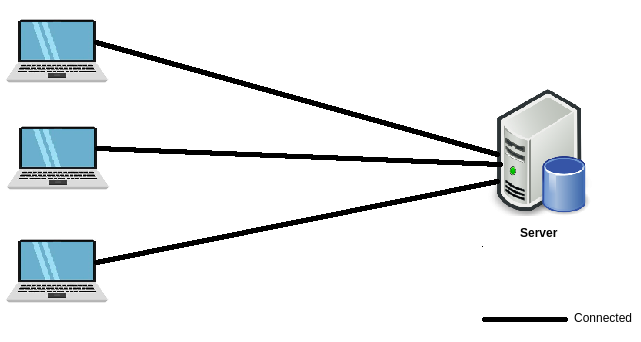
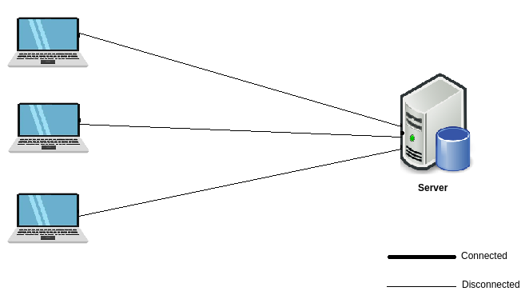
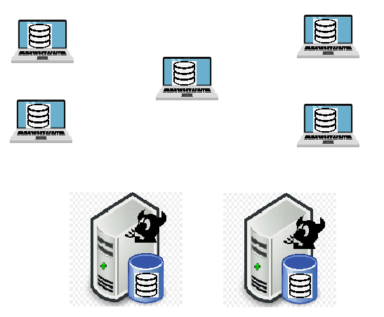

## Sample Pipeline

## Need for Version Control System/Requirements for System to store code
* Common server/Appication/System to store the code from mutiple developers.
* Version should be maintained for every change.
* Multiple users/developers should be allowed to work on same file/code.
* Any system satisfying these 3 point is a version control system.
* VCS
    * CVS
    * VSS
    * SVN
    * CleanCase
    * GIT

## Architechtures of VCS
* Client-Server Architecture:
    * Connected:
        * Client should be connected to servers all time.
        * Administrators are required to take backup and replicate multi-sites.
        * Network connectvity issue could disrupt developers in doing work.
        
        

    * Dis-Connected:
        * Clients needed to connect servers only for getting latest code or submit work. Clients can work on offline mode.
        * Administrators are required to take backup and replicate multi-sites.

        

* Distributed Architecture:
    * Whole copy of code is present on every node (client).
    * Backup of the code is one more node.
    * Other site is one more node.
    * GIT is distributed VCS.

    

## Installing git
* Windows 
    * Chocolatey: 
        * Install Chocolatey from [here](https://chocolatey.org/install)
        * Open Powershell and execute `choco install git`
        * verify by `git --version`
* Linux
    * For ubuntu: `sudo apt-get update -y && sudo apt-get install git -y`
    * For RHEL: `sudo yum install git -y`
* Mac
    * Install homebrew and xcode

## Git operations on Node (Local)
* 