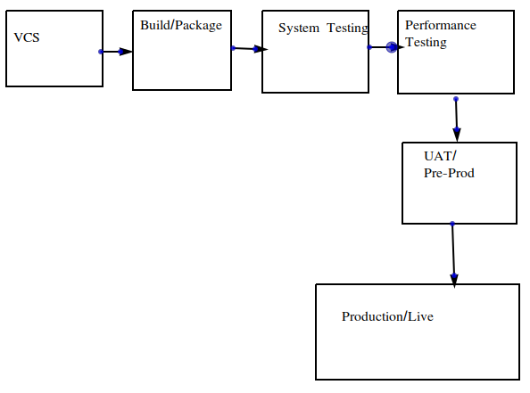

## Sample Pipeline

## Installing git
* Windows 
    * Chocolatey: 
        * Install Chocolatey from [here](https://chocolatey.org/install)
        * Open Powershell and execute `choco install git`
        * verify by `git --version`
* Linux
    * For ubuntu: `sudo apt-get update -y && sudo apt-get install git -y`
    * For RHEL: `sudo yum install git -y`
* Mac
    * Install homebrew and xcode

## Git operations on Node (Local)
* 